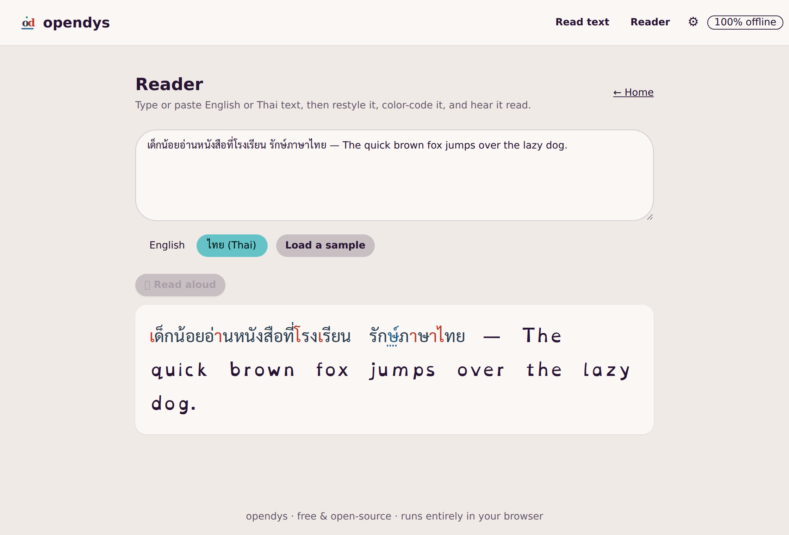

# opendys

**A free, 100% client-side dyslexia reading aid for English and Thai.** Capture or paste text, then
read it in a deeply customizable, dyslexia-friendly interface — with offline OCR, color-coded Thai
orthography, a reading ruler, and text-to-speech. Everything runs in your browser, and **by default
nothing you scan or read leaves your device** — with one opt-in exception (cloud OCR for hard Thai, below).

[](https://github.com/lumduan/opendys/actions/workflows/ci.yml)
[](LICENSE)




## Why

Reading tools for dyslexia are often paid, cloud-based, and English-only. opendys is free,
open-source, and **private by design** — and it treats **Thai** as a first-class script, handling its
4-level vertical orthography (base consonants, vowels, tone marks, and silent finals) that generic
tools ignore.

## Features

- **Offline OCR** — snap a photo or upload an image; recognize English + Thai text on-device with
  Tesseract.js. No image is uploaded (an optional [cloud engine](#thai-ocr-enhancement-optional) for
  hard Thai is off by default).
- **Thai 4-level color coding** — consonants, vowels, tone marks, and silent finals (การันต์) are
  colored and cued, with an optional **colorblind-safe** palette and a non-color underline for silent
  letters.
- **Dyslexia-friendly reader** — OpenDyslexic / looped Thai (Sarabun) / Mitr fonts; adjustable size,
  line, word, and letter spacing; optional Thai guide lines.
- **Reading ruler** — a dimming band that follows your pointer or the keyboard to keep your place.
- **Read aloud** — offline text-to-speech in English and Thai, tap a sentence or play the whole
  passage.
- **Installable PWA** — works offline after the first visit; install it like an app.

## Privacy

opendys is **private by default — zero-egress**. There is no backend, no telemetry, and no analytics.
The OCR engine, language models, and fonts are all **self-hosted**, and the production build ships a
strict Content-Security-Policy whose `connect-src 'self'` makes the browser **enforce** this: the page
can only talk to its own origin.

The **one exception is opt-in**: if a self-hoster configures the optional
[Enhanced Thai OCR (Cloud)](#thai-ocr-enhancement-optional) engine, and a user turns it on *and* runs a
recognition, that one image is sent — server-side, from nginx — to Typhoon for recognition. It is **off
by default**, the API key never reaches the browser, the `connect-src 'self'` CSP is unchanged, and a
deployment without a key behaves exactly like the zero-egress default.

## Quick start

Run the published image:

```sh
docker run --rm -p 8080:8080 ghcr.io/lumduan/opendys:latest
# open http://localhost:8080
```

Or build and run locally:

```sh
docker compose --profile prod up --build
# open http://localhost:8080
```

> The app shell, reader, fonts, and text-to-speech work fully offline immediately. The OCR language
> models (~24 MB) are cached the first time you run a recognition, so the **first** OCR needs a
> connection; after that, OCR works offline too.

## Development

Requires Node 20+ and npm.

```sh
npm install
npm run dev          # http://localhost:5173  (or: docker compose up)
```

Quality gates (CI runs all of these):

```sh
npm run lint
npm run typecheck
npm run test:coverage
npm run build
```

## How it works

- **React 19 + TypeScript + Vite 5**, styled with **Tailwind CSS v3 + DaisyUI v4** (accessible pastel
  themes).
- **OCR**: `tesseract.js@7` in its own Web Worker; the worker, WASM core, and `eng`/`tha` models are
  copied into the build and served same-origin (see
  [ADR-0004](docs/plans/adr/ADR-0004-ocr-model-packaging.md)).
- **Thai engine**: pure, unit-tested utilities in `src/utils/thai/` that classify characters by
  vertical level and produce the color model (see
  [ADR-0003](docs/plans/adr/ADR-0003-thai-4level-parsing-strategy.md)).
- **Fonts**: self-hosted via `@fontsource` (SIL OFL) — no CDN.
- **PWA**: `vite-plugin-pwa` (Workbox) precaches the shell + fonts and runtime-caches the OCR assets.
- **Delivery**: multi-stage Docker build → non-root nginx on port 8080 with hardened security headers.

Design decisions and the full roadmap live in [`docs/plans/`](docs/plans/) (HLD, FRD, WBS, ADRs).

## Self-hosting & customizing

- **Behind HTTPS**: opendys serves plain HTTP on `:8080` for a TLS-terminating reverse proxy to sit in
  front of. Add `Strict-Transport-Security` at that edge (it's intentionally not set in-container).
- **Add a language**: see [CONTRIBUTING.md](CONTRIBUTING.md#adding-a-language) — drop in a Tesseract
  model, add UI strings, and (for a new script) a font.

## Thai OCR Enhancement (Optional)

On-device OCR is private and works offline, but Tesseract struggles with **hard Thai documents** —
photographed book pages, decorative layouts, low contrast. For those, opendys can optionally use
**[Typhoon OCR](https://opentyphoon.ai/)**, a Thai-tuned cloud model that is far more accurate on such
inputs. It is **off by default**; enabling it is a self-hoster choice (see
[ADR-0005](docs/plans/adr/ADR-0005-optional-cloud-ocr-typhoon.md)).

**Privacy:** when enabled *and* selected by the user, the image for that recognition is sent to Typhoon's
servers (opentyphoon.ai). The API key is injected **server-side** by nginx and is **never** shipped to
the browser — safe even on a public deployment. With no key configured, the option never appears and
opendys stays 100% on-device.

**Setup (self-hosters):**

1. Get a free API key at **https://opentyphoon.ai/** (the free tier covers roughly 150 pages/day).
2. Put it in your environment as `TYPHOON_API` — e.g. copy `.env.example` to `.env` and set
   `TYPHOON_API=your-typhoon-api-key`. (`.env` is gitignored and never enters the Docker image — it is
   read at **runtime** only, and the key is not prefixed `VITE_` precisely so it never reaches the bundle.)
3. Run the container with that env:
   ```sh
   docker run --rm -p 8080:8080 --env-file .env ghcr.io/lumduan/opendys:latest
   # or:  docker run --rm -p 8080:8080 -e TYPHOON_API=your-key ghcr.io/lumduan/opendys:latest
   # or:  docker compose --profile prod up --build      # reads .env automatically
   ```
4. Reload the app — an **"Enhanced Thai OCR (Cloud)"** toggle appears on the reading screen. Users choose
   it per image, and a notice reminds them the image leaves the device.

## Contributing

Contributions are welcome — please read [CONTRIBUTING.md](CONTRIBUTING.md) and our
[Code of Conduct](CODE_OF_CONDUCT.md). Keep everything client-side, offline, and private.

## License

[MIT](LICENSE) © opendys contributors. Bundled models and fonts retain their own licenses
(Apache-2.0 and SIL OFL-1.1 respectively).
