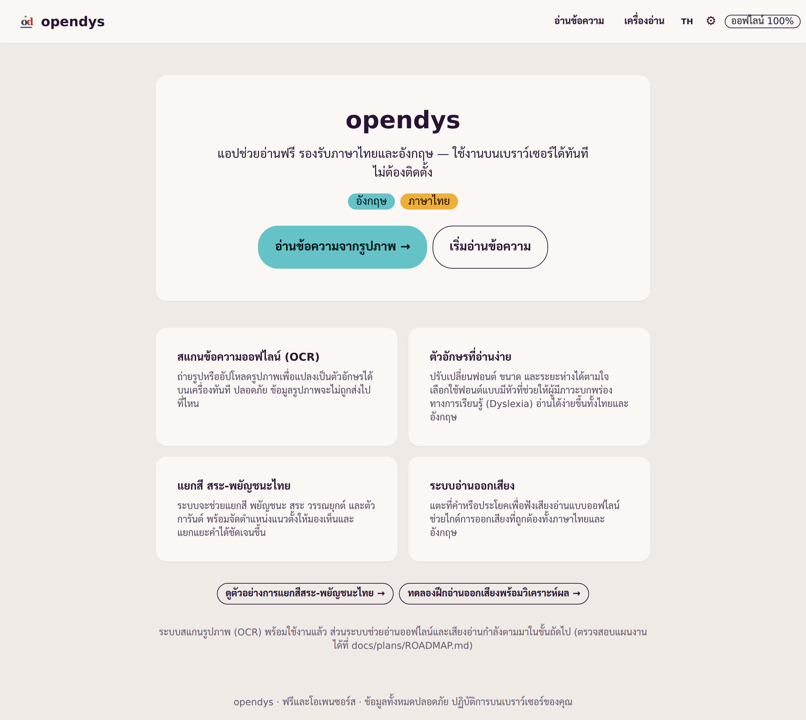
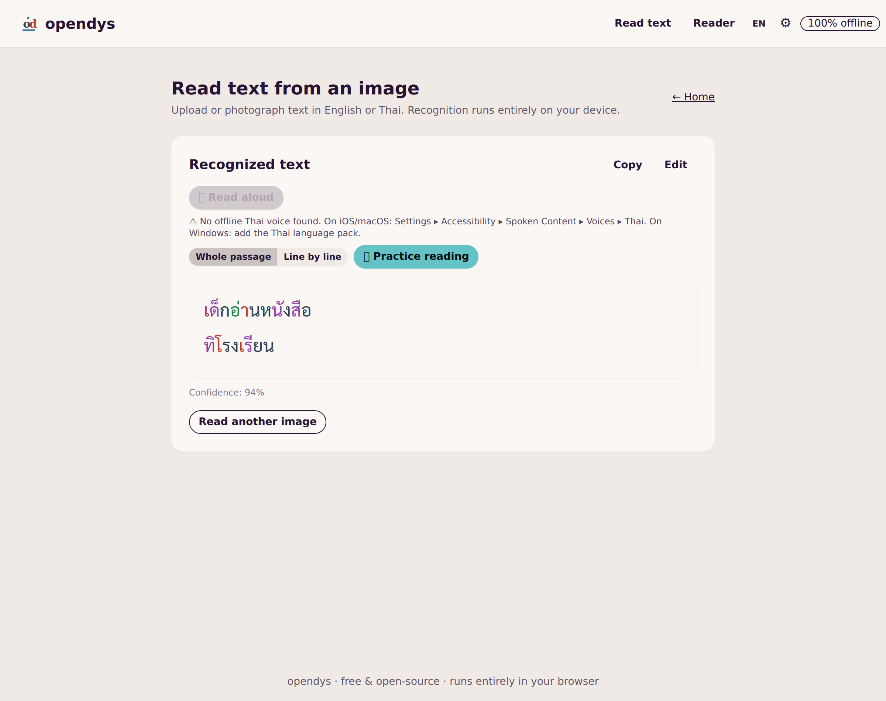
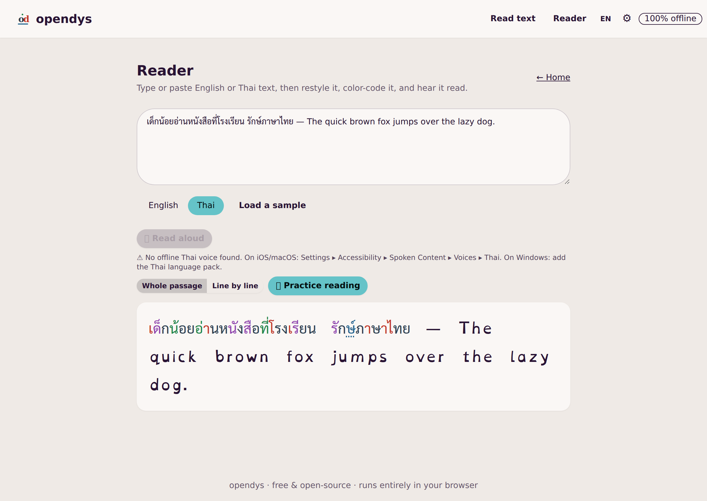
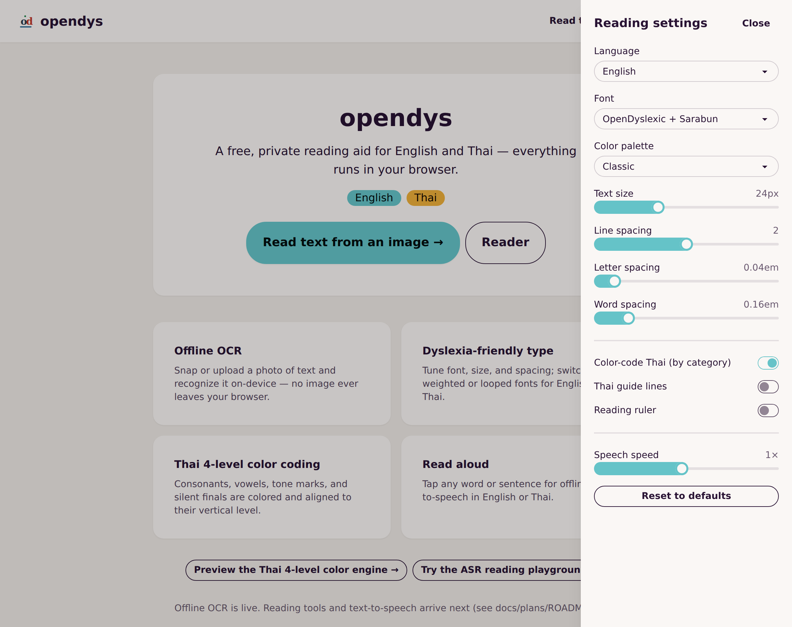

# opendys

<p align="center">
  <a href="README.md"></a>
  <a href="README.th.md"></a>
</p>

**แอปช่วยอ่านสำหรับผู้มีภาวะบกพร่องทางการเรียนรู้ (Dyslexia) ฟรี ทำงานบนเบราว์เซอร์ 100% รองรับทั้งไทยและอังกฤษ**
ถ่ายรูป อัปโหลด หรือวางข้อความ แล้วอ่านในหน้าจอที่ปรับให้อ่านง่ายได้ตามใจ — มีทั้งสแกนข้อความออฟไลน์ (OCR)
การแยกสีตัวอักษรไทย ไม้บรรทัดช่วยอ่าน และเสียงอ่านออกเสียง ทุกอย่างทำงานในเบราว์เซอร์ของคุณ และ
**โดยปกติ ข้อมูลที่คุณสแกนหรืออ่านจะไม่ออกจากเครื่องเลย** — ยกเว้นอย่างเดียวที่คุณเลือกเปิดเอง (OCR ผ่านคลาวด์สำหรับภาษาไทยที่อ่านยาก ดูด้านล่าง)

[](https://github.com/lumduan/opendys/actions/workflows/ci.yml)
[](LICENSE)




## ทำไมถึงมีแอปนี้

เครื่องมือช่วยอ่านสำหรับภาวะบกพร่องทางการเรียนรู้ส่วนใหญ่ต้องเสียเงิน ทำงานบนคลาวด์ และรองรับแต่ภาษาอังกฤษ
opendys ฟรี เป็นโอเพนซอร์ส และ **ออกแบบมาให้เป็นส่วนตัว** — ที่สำคัญคือให้ความสำคัญกับ **ภาษาไทย**
อย่างเต็มที่ รองรับการวางตัวอักษรแบบ 4 ระดับของไทย (พยัญชนะฐาน สระ วรรณยุกต์ และตัวการันต์)
ที่เครื่องมือทั่วไปมักมองข้าม

## ฟีเจอร์

- **สแกนข้อความออฟไลน์ (OCR)** — ถ่ายรูปหรืออัปโหลดรูปภาพ แล้วแปลงข้อความไทยและอังกฤษเป็นตัวอักษรบนเครื่อง
  ด้วย Tesseract.js รูปภาพจะไม่ถูกส่งออกไปไหน (มี [โหมดคลาวด์](#ocr-ภาษาไทยแม่นยำขึ้น-ทางเลือก) สำหรับภาษาไทยที่อ่านยาก
  ซึ่งปิดไว้เป็นค่าเริ่มต้น) ข้อความไทยที่อ่านได้จะถูกแยกสีให้พร้อมอ่าน ฟังเสียง หรือฝึกอ่านทันที:

  
- **แยกสีตัวอักษรไทย 4 ระดับ** — พยัญชนะ สระ วรรณยุกต์ และตัวการันต์ ถูกแยกสีและมีสัญลักษณ์ช่วย
  มีทั้งชุดสีแบบ **สำหรับตาบอดสี** และเส้นใต้สำหรับตัวการันต์ (ไม่พึ่งสีอย่างเดียว)
- **หน้าอ่านที่ออกแบบมาเพื่อ Dyslexia** — ฟอนต์ OpenDyslexic / ฟอนต์ไทยมีหัว (สารบรรณ) / Mitr
  ปรับขนาด ระยะบรรทัด ระยะคำ และระยะตัวอักษรได้ พร้อมเส้นบรรทัดไทยแบบเปิด-ปิดได้
- **ไม้บรรทัดช่วยอ่าน** — แถบเน้นที่เลื่อนตามเมาส์หรือแป้นพิมพ์ ช่วยให้ไม่หลงบรรทัด
- **อ่านออกเสียง** — เสียงอ่านออฟไลน์ทั้งไทยและอังกฤษ แตะประโยคหรือเล่นทั้งย่อหน้าก็ได้
- **ติดตั้งเป็นแอป (PWA)** — ใช้งานออฟไลน์ได้หลังเปิดครั้งแรก และติดตั้งเหมือนแอปทั่วไป



การตั้งค่าการอ่านทั้งหมดอยู่ในลิ้นชักเดียว — ฟอนต์ ขนาด ระยะห่าง ชุดสี เส้นบรรทัด ไม้บรรทัดช่วยอ่าน และความเร็วเสียงอ่าน:



## ความเป็นส่วนตัว

opendys **เป็นส่วนตัวโดยค่าเริ่มต้น — ไม่มีข้อมูลออกจากเครื่อง** ไม่มีเซิร์ฟเวอร์เบื้องหลัง ไม่มีการเก็บสถิติ
และไม่มีการติดตามใด ๆ ตัวอ่าน OCR โมเดลภาษา และฟอนต์ทั้งหมด **อยู่ในตัวแอปเอง** และเวอร์ชันสำหรับใช้งานจริง
มาพร้อม Content-Security-Policy ที่เข้มงวด โดย `connect-src 'self'` ทำให้เบราว์เซอร์ **บังคับ** ให้หน้าเว็บ
ติดต่อได้เฉพาะกับต้นทางของตัวเองเท่านั้น

**ข้อยกเว้นเดียวคือสิ่งที่คุณเลือกเปิดเอง:** ถ้าผู้ดูแลระบบตั้งค่าโหมด
[OCR ภาษาไทยแม่นยำขึ้น (ผ่านคลาวด์)](#ocr-ภาษาไทยแม่นยำขึ้น-ทางเลือก) ไว้ และผู้ใช้เปิดใช้ *แล้ว* สั่งอ่านรูป
รูปนั้นรูปเดียวจึงจะถูกส่ง — จากฝั่งเซิร์ฟเวอร์ผ่าน nginx — ไปให้ Typhoon อ่าน โหมดนี้ **ปิดไว้เป็นค่าเริ่มต้น**
คีย์ API ไม่เคยไปถึงเบราว์เซอร์ นโยบาย `connect-src 'self'` ไม่เปลี่ยน และถ้าไม่ได้ตั้งคีย์ไว้
แอปจะทำงานแบบไม่มีข้อมูลออกจากเครื่องเหมือนค่าเริ่มต้นทุกประการ

## เริ่มต้นใช้งาน

รันจากอิมเมจที่เผยแพร่ไว้:

```sh
docker run --rm -p 8080:8080 ghcr.io/lumduan/opendys:latest
# open http://localhost:8080
```

หรือจะ build แล้วรันเองบนเครื่อง:

```sh
docker compose --profile prod up --build
# open http://localhost:8080
```

> ตัวแอป หน้าอ่าน ฟอนต์ และเสียงอ่าน ทำงานออฟไลน์ได้ทันที ส่วนโมเดลภาษาของ OCR (~24 MB) จะถูกเก็บไว้
> ในเครื่องตอนที่คุณสั่งอ่านครั้งแรก ดังนั้น OCR **ครั้งแรก** ต้องต่ออินเทอร์เน็ต หลังจากนั้นก็ใช้ออฟไลน์ได้เช่นกัน

## สำหรับนักพัฒนา

ต้องใช้ Node 20+ และ npm

```sh
npm install
npm run dev          # http://localhost:5173  (or: docker compose up)
```

ด่านตรวจคุณภาพ (CI รันทั้งหมดนี้):

```sh
npm run lint
npm run typecheck
npm run test:coverage
npm run build
```

## ทำงานอย่างไร

- **React 19 + TypeScript + Vite 5** จัดสไตล์ด้วย **Tailwind CSS v3 + DaisyUI v4** (ธีมพาสเทลที่เข้าถึงง่าย)
- **OCR**: `tesseract.js@7` ทำงานใน Web Worker ของตัวเอง โดย worker, WASM core และโมเดล `eng`/`tha`
  ถูกรวมไว้ในตัว build และเสิร์ฟจากต้นทางเดียวกัน (ดู
  [ADR-0004](docs/plans/adr/ADR-0004-ocr-model-packaging.md))
- **เอนจินภาษาไทย**: ยูทิลิตีบริสุทธิ์ที่มีเทสต์ครบใน `src/utils/thai/` ซึ่งจำแนกตัวอักษรตามระดับแนวตั้ง
  แล้วสร้างแบบจำลองสี (ดู
  [ADR-0003](docs/plans/adr/ADR-0003-thai-4level-parsing-strategy.md))
- **ฟอนต์**: มาในตัวผ่าน `@fontsource` (SIL OFL) — ไม่ใช้ CDN
- **PWA**: `vite-plugin-pwa` (Workbox) เก็บตัวแอป + ฟอนต์ไว้ล่วงหน้า และเก็บไฟล์ OCR ตอนใช้งานจริง
- **การส่งมอบ**: Docker แบบหลายสเตจ → nginx ที่ไม่ใช้ root บนพอร์ต 8080 พร้อมส่วนหัวความปลอดภัยที่เข้มงวด

รายละเอียดการตัดสินใจเชิงออกแบบและแผนงานทั้งหมดอยู่ที่ [`docs/plans/`](docs/plans/) (HLD, FRD, WBS, ADRs)

## โฮสต์เอง & ปรับแต่ง

- **หลัง HTTPS**: opendys เสิร์ฟ HTTP ธรรมดาบน `:8080` เพื่อให้ reverse proxy ที่จัดการ TLS มาอยู่ด้านหน้า
  แล้วเพิ่ม `Strict-Transport-Security` ที่ชั้นนั้น (ตั้งใจไม่ใส่ไว้ในคอนเทนเนอร์)
- **เพิ่มภาษา**: ดู [CONTRIBUTING.md](CONTRIBUTING.md#adding-a-language) — วางโมเดล Tesseract เพิ่มข้อความ UI
  และ (ถ้าเป็นสคริปต์ใหม่) เพิ่มฟอนต์

## OCR ภาษาไทยแม่นยำขึ้น (ทางเลือก)

OCR บนเครื่องเป็นส่วนตัวและใช้ออฟไลน์ได้ แต่ Tesseract ยังอ่าน **เอกสารไทยที่ยาก** ได้ไม่ดีนัก —
หน้าหนังสือที่ถ่ายรูปมา เลย์เอาต์มีลวดลาย หรือคอนทราสต์ต่ำ สำหรับกรณีแบบนั้น opendys เลือกใช้
**[Typhoon OCR](https://opentyphoon.ai/)** ได้ ซึ่งเป็นโมเดลคลาวด์ที่ปรับมาเพื่อภาษาไทยและแม่นยำกว่ามากกับงานแบบนี้
โหมดนี้ **ปิดไว้เป็นค่าเริ่มต้น** การเปิดใช้เป็นทางเลือกของผู้ดูแลระบบ (ดู
[ADR-0005](docs/plans/adr/ADR-0005-optional-cloud-ocr-typhoon.md))

**ความเป็นส่วนตัว:** เมื่อเปิดใช้ *และ* ผู้ใช้เลือกเอง รูปสำหรับการอ่านครั้งนั้นจะถูกส่งไปยังเซิร์ฟเวอร์ของ Typhoon
(opentyphoon.ai) โดยคีย์ API ถูกใส่ **ฝั่งเซิร์ฟเวอร์** ผ่าน nginx และ **ไม่เคย** ส่งไปถึงเบราว์เซอร์ —
ปลอดภัยแม้จะเปิดให้ใช้แบบสาธารณะ ถ้าไม่ได้ตั้งคีย์ไว้ ตัวเลือกนี้จะไม่ปรากฏ และ opendys จะทำงานบนเครื่อง 100%

**การตั้งค่า (สำหรับผู้โฮสต์เอง):**

1. ขอคีย์ API ฟรีที่ **https://opentyphoon.ai/** (แพ็กเกจฟรีครอบคลุมประมาณ 150 หน้า/วัน)
2. ใส่ไว้ในตัวแปรสภาพแวดล้อมชื่อ `TYPHOON_API` — เช่น คัดลอก `.env.example` เป็น `.env` แล้วตั้งค่า
   `TYPHOON_API=your-typhoon-api-key` (ไฟล์ `.env` ถูก gitignore ไว้และไม่เคยเข้าไปในอิมเมจ Docker
   มันถูกอ่านตอน **รันไทม์** เท่านั้น และคีย์ไม่ได้ขึ้นต้นด้วย `VITE_` เพื่อให้ไม่มีทางหลุดไปอยู่ในบันเดิล)
3. รันคอนเทนเนอร์พร้อมตัวแปรนั้น:
   ```sh
   docker run --rm -p 8080:8080 --env-file .env ghcr.io/lumduan/opendys:latest
   # or:  docker run --rm -p 8080:8080 -e TYPHOON_API=your-key ghcr.io/lumduan/opendys:latest
   # or:  docker compose --profile prod up --build      # reads .env automatically
   ```
4. โหลดแอปใหม่ — จะมีสวิตช์ **"Enhanced Thai OCR (Cloud)"** ปรากฏบนหน้าจออ่าน ผู้ใช้เลือกใช้เป็นรายรูป
   และมีข้อความเตือนว่ารูปจะออกจากเครื่อง

## ร่วมพัฒนา

ยินดีรับการมีส่วนร่วม — โปรดอ่าน [CONTRIBUTING.md](CONTRIBUTING.md) และ
[แนวปฏิบัติของชุมชน](CODE_OF_CONDUCT.md) ของเรา ขอให้ทุกอย่างยังทำงานบนฝั่งผู้ใช้ ออฟไลน์ และเป็นส่วนตัว

## สัญญาอนุญาต

[MIT](LICENSE) © ผู้ร่วมพัฒนา opendys โมเดลและฟอนต์ที่รวมมามีสัญญาอนุญาตของตนเอง
(Apache-2.0 และ SIL OFL-1.1 ตามลำดับ)
